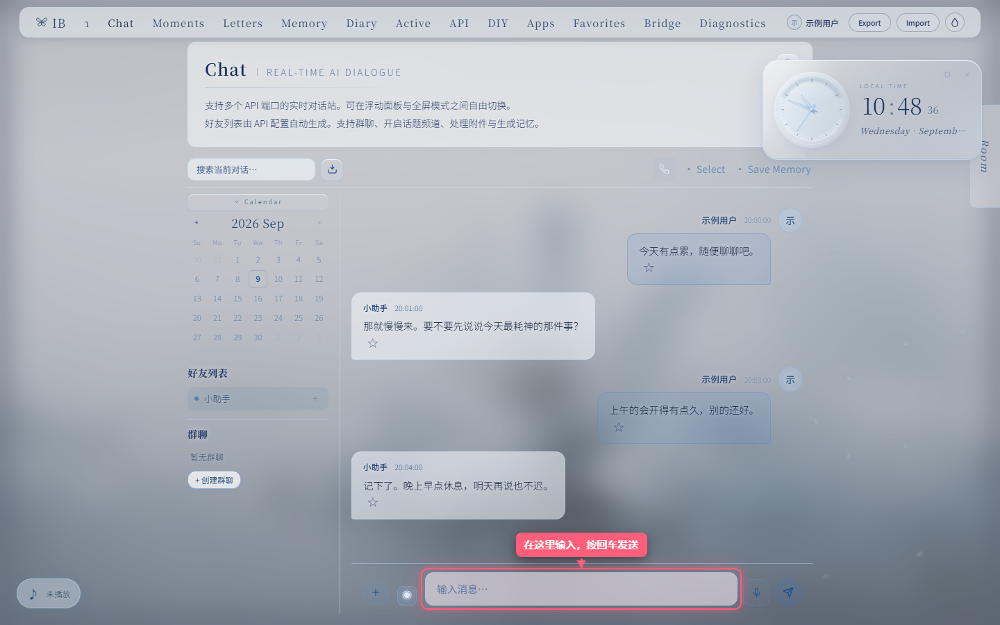
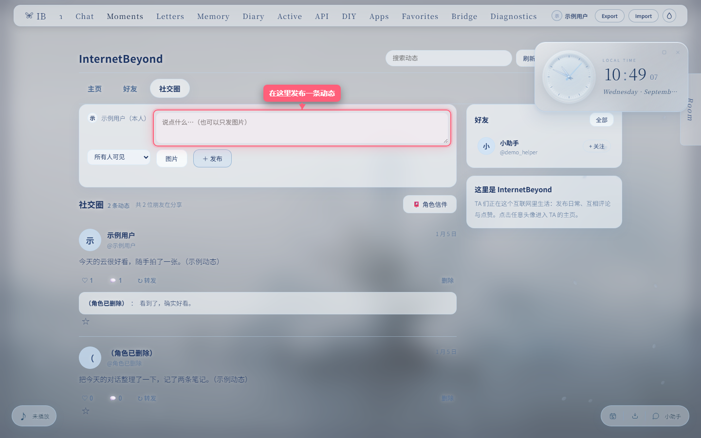
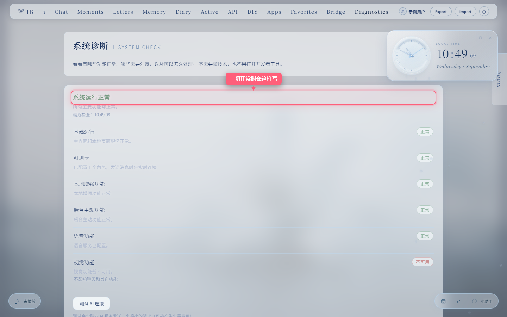

# InternalBeyond

**一个离线运行、数据留在本机的个人 AI 陪伴站。** 支持同时对接多个 AI 模型，
包含像素互动房间、多角色聊天、社交圈、长期记忆、日记、书信、代码工作区等 13 个模块与两套视觉主题。

`Windows 10+` · 当前版本 **1.0.0** · 免管理员权限 · 内置运行环境 · [PolyForm Noncommercial 1.0.0](LICENSE)

---

## ⬇ 下载 InternalBeyond for Windows

**正式发行文件：`InternalBeyond-Setup-<版本号>.exe`（当前 1.0.0，约 48 MB）**

👉 **[前往 GitHub Releases 下载最新版](https://github.com/yydye/InternalBeyond/releases)**

请在 **Releases 页面**下载安装包与 `SHA256SUMS.txt`。不要从第三方网盘、群文件下载。

## 安装（Windows）

> **不需要预装 Node.js、npm、Python 或 PowerShell；不需要管理员权限，安装过程不会弹出 UAC 权限确认。**

1. 在 [Releases 页面](https://github.com/yydye/InternalBeyond/releases) 下载 `InternalBeyond-Setup-1.0.0.exe`。
2. 双击安装包，按向导点「下一步」：欢迎页 → 安装位置（保持默认即可）→ 是否创建桌面快捷方式（可选）→ 安装 → 完成。
3. 勾选「启动 InternalBeyond」，或之后从 **开始菜单** / **桌面** 的 **InternalBeyond** 打开。
4. 第一次打开会进入设置向导，跟着 7 步完成 AI 配置与角色创建，就能发出第一条消息。

**只有一个入口。** 安装后你只需要认识 **InternalBeyond** 这个名字（开始菜单与桌面快捷方式），
不需要在多个脚本之间做选择，也不会弹出任何黑色命令行窗口。本地增强功能会随它自动启动。

### 安装到哪里 / 我的数据在哪里

| 内容 | 位置 | 升级时 | 卸载时 |
|---|---|---|---|
| 程序文件（含内置运行环境） | `%LOCALAPPDATA%\Programs\InternalBeyond`（默认，可改） | 被替换为新版 | 被删除 |
| 你的个人数据（角色、API 配置、Memory、Diary、朋友圈等） | `%LOCALAPPDATA%\InternalBeyond` 与浏览器本地数据 | **完整保留** | **默认保留** |

- **升级**：直接运行新版安装包覆盖安装即可；角色、API 配置、Memory、Diary、朋友圈等全部保留，不需要重新配置。
- **卸载**：开始菜单 →「卸载 InternalBeyond」。卸载**默认不会删除个人数据**；如果确实要彻底清除，请手动删除 `%LOCALAPPDATA%\InternalBeyond`（浏览器本地数据请在浏览器设置里清除该站点的数据）。
- **正在运行时安装**：安装程序只会通过 InternalBeyond 自己的服务控制面关闭 InternalBeyond 实例（先优雅停止、再有限等待、最后只结束经过身份校验的自身进程），**不会影响你电脑上其他基于 Node.js 的软件**。

### 首次运行时的 Windows 提示（未签名程序）

本项目**不购买代码签名证书**，因此首次运行安装包或程序时，Windows 可能显示「Windows 已保护你的电脑 / 未知发布者」或 SmartScreen 提示。这是 Windows 对所有未签名程序的标准提示，**不代表程序有问题**。

请这样处理：

1. 确认文件确实来自**官方发布页**（不要从第三方网盘、群文件下载）；
2. 用发布页提供的 `SHA256SUMS.txt` 校验文件（Windows 自带命令，无需安装任何东西）：

   ```bat
   certutil -hashfile InternalBeyond-Setup-<版本号>.exe SHA256
   ```

   把输出与 `SHA256SUMS.txt` 里对应的一行对比，一致即可放心安装。
3. 确认来源与校验值后，点「更多信息」→「仍要运行」继续安装。

**请不要关闭 Windows 的安全防护**（不要关闭 SmartScreen、不要长期关闭 Defender）。校验来源比关闭防护更安全。

### 第一次使用

打开应用后，左侧「说明」页（**Guide**）里的**零基础使用指南**会带你完成第一次设置、添加 AI、创建角色并发出第一条消息，全程配有真实截图，不需要打开任何命令窗口。

- **设置向导**：首次打开自动出现，7 步走完即可对话；跳过之后可在 API 页「重新运行设置向导」重新进入。
- **系统诊断**：导航栏 **Diagnostics**（或 API 页顶部的「打开系统诊断」）用普通话说清"什么功能出了问题、是否影响聊天、能不能一键恢复"，并可一键导出脱敏诊断报告。
- **API Key 安全**：密钥只保存在你自己的这台电脑上；本指南与导出的诊断报告都不包含它。

---

## 功能预览

截图来自 P6 图文教程管线：真实页面 + 全新临时浏览器配置 + 合成演示数据（不含任何真实密钥与私人数据）。

| Chat · 多角色对话 | 社交圈 · Moments / Social Net | 系统诊断 · Diagnostics |
|---|---|---|
|  |  |  |

---

## 功能一览

| 模块 | 说明 |
|------|------|
| **Room** | 像素互动房间（1672×941），含 Sui 对话、茶歇、互动故事、塔罗占卜、换装、休息六个子模块 |
| **Chat** | 多端口 AI 实时对话 — 浮动面板 + 全屏 + 群聊 + 图像生成 + 附件处理 + Token 仪表盘 |
| **Calendar** | AI 日历 — 悬浮小窗 + 挂历视窗，纪念日 / 生日 / 计划 / 记录，月相节气与传统节日，AI 读取临近日程、聊天中提起并留便笺 |
| **Blog** | 日志 / 密码日记本 / AI 评论 / AI 批注 / 自定义剧本 |
| **Letters** | AI 书信 — 异步通信，AI 读取你的资料后写回信 |
| **Memory** | 长期情感记忆库 — 星图可视化 + 自然衰减 + API 上下文自动注入 + Auto Memory（AI 自主记忆） |
| **Active** | 全天候主动信息 — 每天 / 每周 / 自定义间隔，结合角色设定、关系、Memory、时间与最近聊天生成；关页后仍可继续（本地服务随应用自动启动） |
| **Moments** | AI 朋友圈 → 已升级为 **社交圈（AI 社交网络）**：角色拥有主页（Banner/头像/@账号/简介/签名/关注）、混合 Feed（文字/图片/点赞/评论/回复线程/转发引用）、好友目录与完整讨论串；角色自主发布、互评互赞与私人日志全部保留（有冷却与去重） |
| **Music** | 本地音乐播放器 + 48 条频率可视化波形 |
| **Profile** | 液态玻璃风格个人名片 — 头像 + 简介 + 作品集 |
| **API** | 角色配置中心 — 角色数量不限，各有昵称、关系与提示词；单个群聊最多 10 名成员 |
| **ICode** | AI 代码工作区 — 文件管理 + 预览 + 内联编辑 + 搜索定位 + 脚本沙箱运行 + 文档生成（DOCX / PDF / XLSX） |
| **DIY** | 自定义透明立绘、占卜桌布、外部工具、MCP 服务器、沙箱扩展与文件解析库 |

配套能力：语音通话（Phase 1 浏览器 VAD + 回合式 ASR/TTS）、共读 / 观影等陪伴活动、AI 日记、收藏夹、行为观测层。

## 主题系统

导航栏右侧按钮切换 **Internal**（明亮）与 **Infernal**（暗色）。切换时首页标题淡出重入、背景交叉溶解，
雨效果与界面色调同步变化，所有子页面自适应；主题选择保存在本地，刷新后保持。

## 支持的 AI 服务

内置 15 个 provider 元数据（唯一来源 `assets/js/provider-directory.js`）：
Anthropic、OpenAI、Grok、DeepSeek、Gemini、GLM、Qwen、豆包、Moonshot、MiMo、MiniMax、Yi、百川、Mistral，以及任意 OpenAI 兼容的自定义中转站。
**角色数量不限**；单个群聊最多 10 名成员。

- **云端 API**：在 API 页添加密钥即可；支持 Anthropic 原生格式与 OpenAI 兼容格式。
- **本机模型（可选）**：**API → 数据保险 → 本地优先中心** 提供 Ollama（`127.0.0.1:11434`）、LM Studio（`127.0.0.1:1234`）、vLLM / OpenAI 兼容服务（`127.0.0.1:8000`）预设。仅允许回环端点，因此本机模型可以不填 API Key。
- **离线就绪度**：文件解析库按需下载并缓存；Python / Pyodide 运行时仍是按需资源。
- **静谧模式**：关闭背景动效、玻璃模糊与长过渡，适合省电、低性能设备与专注写作。

## 数据与隐私

- **数据在你自己的电脑上**：核心数据保存在浏览器 IndexedDB；只有你显式开启"关页调度"的 Active 计划才会额外写入本机服务的数据文件。不使用云端调度服务器，不上传聊天内容。
- **导出 / 导入**：右上角 **Export** 导出备份，**Import** 导入；另有加密 `.ibvault` 备份。
- **⚠ 备份建议**：数据仅存于浏览器本地，清除浏览器数据或换浏览器将永久丢失，请定期导出。
- **设备兼容性**：需支持 IndexedDB、CSS backdrop-filter、ES6+ 的现代浏览器（推荐 Chrome / Edge / Firefox 最新版）。Windows / macOS / Linux、iPhone / iPad、Android / HarmonyOS 均可访问；Room 模块设计视口 1672×941px，桌面端体验最佳。

---

## For Developers / 从源码运行

> 以下内容面向开发者与想改代码的人。**普通用户请用上面的安装包**——
> 开发期入口（`.cmd` / `.vbs` / 直接打开 HTML）都不会随安装包分发。

### 免安装（ZIP）

1. 下载本仓库（**Code → Download ZIP**）或 `git clone`；
2. 解压后直接打开 `InternalBeyond.html` 即可使用基础功能（日志、换装、主题、音乐等）；AI 功能需要联网调用 API。

### 本地服务（可选）

需要服务器能力的功能（表情包、心语墙、健康 / 定位 / 天气看板、点歌、Bark / ntfy 推送、AI 常驻会话、TTS 语音气泡、多窗口同步，以及关页后的主动消息与朋友圈调度）由一个本机 Node 后端提供，无需云服务器。

- **统一启动**：运行 `scripts\windows\start-local-services.cmd` 一次启动 Bridge 与 Active；仅需 Bridge 时运行 `scripts\windows\start-bridge-service.cmd`；仅需 Active 时运行 `scripts\windows\start-active-service.cmd`。
- **统一控制器**：`node runtime\local-services-runner.js --status`（人类可读）/ `--json`（脚本可读）/ `--vision`（一并启动可选视觉助手）；窗口内 `s` 查看状态、`q` 只停止它自己启动的子服务。
- **状态与日志**：服务日志在 `%LOCALAPPDATA%\InternalBeyond\logs\`；启动记录 `boot-state.json`；启动器日志 `logs\launcher.log`（均不含密钥 / Token）。
- **端口**：Bridge `23115`、Active `23114`、静态 Web `23120`、静默重启控制面 `23116`、Vision（可选）`8765`。均可用 `IB_BRIDGE_PORT` / `IB_ACTIVE_PORT` / `IB_WEB_PORT` / `IB_RESTART_PORT` / `IB_VISION_PORT` 覆盖。
- **Node 运行时解析顺序**：`IB_NODE` → `runtime\node\node.exe`（随包内置，正式安装包的唯一路径）→ PATH 中的 `node.exe`（**仅开发 / 兼容兜底**）。内置运行时**缺失**时回退 PATH；**存在但无法运行**（损坏）时报错且**不回退**；主版本低于 18 拒绝启动。版本固定为 Node 24 LTS 的精确 patch（见 `runtime/node/VERSION`），由 `scripts/update-node-runtime.ps1` 下载并按官方 `SHASUMS256.txt` 校验 SHA-256，许可见 `LICENSES/THIRD-PARTY-NODE.md`。

### 从源码启动（Windows）

- `启动 InternalBeyond.vbs` 是正式启动链的实现（安装包的快捷方式最终执行它）：定位自身目录 → 解析 Node 运行时 → 委托唯一真实逻辑 `runtime\launch-internal-beyond.js`；`--debug` 让启动过程可见。
- `scripts\windows\Start Internal Beyond.cmd` 保留为**兼容别名**（同样只调用 `runtime\launch-internal-beyond.js`，非第二套逻辑）。
- 需要显式看到 / 控制服务进程时，用 `scripts\windows\start-local-services.cmd`。
- **桌面快捷方式**：`scripts\windows\create-desktop-shortcut.cmd` 幂等创建 / 刷新桌面 `InternalBeyond.lnk`（目标指向 `启动 InternalBeyond.vbs`，图标 `assets\icons\IB-icon.ico`）；移动项目后重跑一次即可。

### 测试

零依赖，需要本机 Chrome / Edge 时会在浏览器组中自动使用。

```bash
node tests/test-all.js --quick     # 静态结构 + 本地服务（无浏览器，约 17 秒）
node tests/test-all.js --all       # 三组全跑（static / service / browser）
node scripts/scripts_check_html.js InternalBeyond.html   # HTML 内全部 script 块逐个 node --check
```

- 前端回归：`scripts\windows\test-ui.cmd`（或依次运行 `scripts\scripts_check_html.js`、`tests\test_frontend_structure.js`、`tests\test_game_smoke.js`、`tests\test_ui_regression.js`）。
- 安装包相关（**不安装、不开浏览器**）：`node tests/test_installer.js`、`node tests/test_installer_mock.js`、`node tests/test_ib_stop_identity.js`、`node tests/test_node_runtime.js`。
- 测试预算与隔离规则见 [`docs/P7-TEST-BUDGET.md`](docs/P7-TEST-BUDGET.md)。

### 构建安装包

```powershell
powershell -NoProfile -ExecutionPolicy Bypass -File scripts\build-installer.ps1
```

构建产物在 `dist\`（安装包 + `SHA256SUMS.txt`），**默认不安装**；载荷来自白名单清单
[`scripts/release-manifest.js`](scripts/release-manifest.js)，仓库里的开发文件不会因为忘记排除而进入发行包。
`dist/` 已加入 `.gitignore`，正式产物通过 GitHub Releases 发布，不进入源码历史。

### 项目结构（简）

```
InternalBeyond.html        # 唯一 HTML 入口
VERSION / LICENSE          # 单一发行版本源 / 项目许可
启动 InternalBeyond.vbs    # 用户启动入口（安装包快捷方式目标）
services/                  # 本地服务：Bridge(23115) / Active(23114) / 静态页面服务(23120)
runtime/                   # 启动链（launcher / runner / boot-state / product-version）+ node/ 内置运行时
bridge/                    # Bridge 域模块（config/clients/tts/ws/routes/…）
active/                    # Active 域模块（plans/moments/scheduler/model-client/http/…）
assets/{css,js}/           # 前端样式与脚本（无打包、按 HTML 顺序加载）
assets/images/             # 主题背景（bg-internal / bg-infernal / bg-canvas）
assets/icons/IB-icon.ico   # 官方图标（快捷方式 / 卸载项 / 通知）
game/                      # Room 游戏引擎（六个模块）
apps/                      # APP 目录（catalog.json + 外部应用）
installer/                 # Inno Setup 脚本、语言文件、运行时 pin、停止助手
scripts/                   # 构建 / 发行审计 / 截图管线 / 运行时更新 / scripts_check_html.js
scripts/windows/           # 开发期 Windows 辅助脚本（start-*.cmd / 快捷方式 / test-ui.cmd）
docs/                      # 架构与机制文档、教程截图、历史归档
tests/                     # 全部测试套件（test-all.js 入口 + 各套件 + 校准框架）
vision/                    # 可选本地视觉服务（Python，默认不随包分发）
```

完整目录、模块职责、端口与协议见 [`ARCHITECTURE.md`](docs/ARCHITECTURE.md)。

### 文档索引

| 文档 | 回答什么 |
|---|---|
| [`README.md`](README.md) | 安装、使用、下载（本文件） |
| [`TROUBLESHOOTING.md`](docs/TROUBLESHOOTING.md) | 遇到问题先查这里 |
| [`ARCHITECTURE.md`](docs/ARCHITECTURE.md) | 这个项目是怎么工作的 |
| [`DECISIONS.md`](docs/DECISIONS.md) | 为什么这么设计（D1–D18，"不要随便改"清单） |
| [`HANDOVER.md`](docs/HANDOVER.md) | 现状、待办、DO / DON'T（Agent 第一入口） |
| [`CHANGELOG.md`](docs/CHANGELOG.md) | 以前发生过什么 |
| [`docs/CHRONICLE.md`](docs/CHRONICLE.md) | 编年史（上游 → fork 全史） |
| [`docs/WHY_IB.md`](docs/WHY_IB.md) / [`docs/SOCIAL_RUNTIME.md`](docs/SOCIAL_RUNTIME.md) / [`docs/MEMORY.md`](docs/MEMORY.md) / [`docs/AUTONOMY.md`](docs/AUTONOMY.md) / [`docs/OFFLINE.md`](docs/OFFLINE.md) | 定位、社会闭环、记忆、自主性、离线能力 |
| [`docs/history/`](docs/history/README.md) | 阶段性实施报告与审计归档 |
| [`INTERNALBEYOND_AI_RULES.md`](docs/INTERNALBEYOND_AI_RULES.md) | 开发契约（权限边界、修改纪律） |

---

## Introduction (EN)

**InternalBeyond** is a local-first personal AI companion site that runs offline and keeps your data on your own machine.
It ships 13 feature modules, two visual themes, and can talk to 15 AI providers at once.

**Download for Windows:** see [GitHub Releases](https://github.com/yydye/InternalBeyond/releases) →
`InternalBeyond-Setup-1.0.0.exe`. No Node.js, npm, Python, PowerShell or admin rights required;
the installer bundles its own runtime and needs no UAC prompt.

1. Download `InternalBeyond-Setup-<version>.exe` from Releases and verify it against `SHA256SUMS.txt`.
2. Double-click and follow the wizard (welcome → install location → optional desktop icon → install → finish).
3. Launch **InternalBeyond** from the Start menu or desktop.
4. Finish the first-run setup wizard (7 steps), then send your first message.

### Features

- **Room** — pixel-art interactive room with six sub-modules (host dialogue, tea, story, tarot, wardrobe, sleep) and a mini pet window.
- **Chat** — multi-provider conversations with floating panel, fullscreen, group chat, topic channels, thinking chain, summary, image generation, attachments, token dashboard and memory generation.
- **Calendar** — AI-readable calendar with floating widget, anniversaries, birthdays, plans, moon phases and solar terms.
- **Blog** — journal with categories, AI comments, AI annotations, password diary and custom scripts.
- **Letters** — asynchronous AI correspondence.
- **Memory** — long-term emotional memory with star map, natural decay, automatic context injection and Auto Memory.
- **Active** — character-initiated messages on daily / weekly / custom schedules; keeps running after the browser closes.
- **Moments / Social Net** — AI social network: profiles, mixed feed, likes, comment threads, reposts, private logs and autonomous posting.
- **Music** — local audio player with a 48-band visualizer.
- **Profile** — liquid-glass personal card.
- **API** — unlimited characters with custom nicknames, relationships and system prompts; up to 10 members per group chat.
- **ICode** — AI code workspace with file management, inline editing, search, sandboxed script execution and document generation (DOCX / PDF / XLSX).
- **DIY** — custom portraits, tarot tablecloth, external tools, MCP servers, sandbox extensions and document parsing libraries.

Also included: voice calls, co-reading / cinema activities, AI diary, favorites and a behavior observation layer.

**Data & privacy** — everything is stored locally (browser IndexedDB plus, only for schedules you explicitly enable,
a local service data file). Nothing is uploaded to a scheduling server. Use **Export** / **Import** for backups.

**Developers** — run from source by cloning the repository and opening `InternalBeyond.html`, or run the local services with
`start-local-services.cmd`. Full details, ports, runtime resolution and test/build commands are in the Chinese
[For Developers](#for-developers--从源码运行) section above and in [`ARCHITECTURE.md`](docs/ARCHITECTURE.md).

---

## 关于本仓库 / About this fork

> 本仓库是 [Sui](https://github.com/Sui-IB) 的 **Internal Beyond** 的**非官方二次开发版本**，原项目：
> **[github.com/Sui-IB/InternalBeyond](https://github.com/Sui-IB/InternalBeyond)** （已与原作者沟通）
>
> This is an unofficial derivative of Sui's Internal Beyond. Original project: <https://github.com/Sui-IB/InternalBeyond>
>
> 在原单文件前端基础上，本版本新增了本地 Bridge / Active companion 后端、社交圈扩展（AI↔AI 回复链、后台调度）、行为观测层等模块，
> 并将代码重构为模块化目录，补上了内置 Node 运行时与 Windows 安装包。详细差异见 [`CHANGELOG.md`](docs/CHANGELOG.md)。
> 本修改版遵循与原项目相同的非商业许可条款，与官方版本无从属关系。

## 联系方式

- GitHub：[Sui-IB](https://github.com/Sui-IB)
- X / Twitter：[@underthepuresky](https://x.com/underthepuresky)
- Email：1282901880@qq.com
- 小红书：3628686381
- Bilibili：[主页](https://space.bilibili.com/3546561346800463)

## 许可与版权

© 2025–2026 Sui. Internal Beyond 在 GitHub 公开源代码，并免费供个人、学习、研究及其他非商业用途使用。公开源代码不等于放弃版权，也不授权商业使用或二次贩卖。

- 程序代码：PolyForm Noncommercial License 1.0.0
- 视觉素材与项目文档：在作者有权授权的范围内采用 CC BY-NC-SA 4.0
- 项目名称、Logo 与作者标识：保留相关权利，不授权冒充官方版本

项目图像素材由 OpenAI GPT-IMAGE-2 生成，并由 Sui 使用 Adobe Photoshop CS 进行修改、合成、界面设计与编绘。

允许在保留署名和许可文件的前提下进行非商业使用、修改与分享。未经 Sui 书面授权，不得出售、收费分发、打包进付费产品或服务、商业托管、收费部署或以其他方式获取商业利益。

本项目使用 Anthropic Claude (Opus 4.6) 进行开发构建，Anthropic Claude (Fable 5)、Claude (Opus 4.8)、Claude (Sonnet 4.6)、Claude (Opus 5)、ChatGPT (5.6 Sol) 亦参与了编程工作。AI 工具为辅助创作工具，不对项目内容拥有版权。本声明适用于项目的所有版本与衍生形式。第三方服务名称与商标归各自权利人所有。

完整条款见根目录 `LICENSE` 与 `LICENSES/` 文件夹。商业授权联系：1282901880@qq.com。

### 衍生版本说明

- 本仓库为 Internal Beyond 的**修改版**（维护者：yydye），基于原项目 <https://github.com/Sui-IB/InternalBeyond> 二次开发。按版权声明第四节要求，此处保留作者署名、项目地址与许可文件，并说明主要修改内容：新增本地 Bridge / Active companion 后端与配套测试、社交圈扩展（AI↔AI 回复链 / 后台调度 / User 作者）、行为观测层、前端与服务端模块化拆分、内置 Node 运行时与 Windows 安装包；完整演进记录见 [`CHANGELOG.md`](docs/CHANGELOG.md)。
- 本修改版按与原项目相同的许可（PolyForm Noncommercial License 1.0.0 / CC BY-NC-SA 4.0）非商业分享，不由 Sui 官方发布、认可或保证；原作品的全部权利归 Sui 所有。

**本项目官方版本免费提供。** 如果你通过付费方式获得了未经作者授权的副本，请停止传播，并通过上方联系方式获取免费正版。
